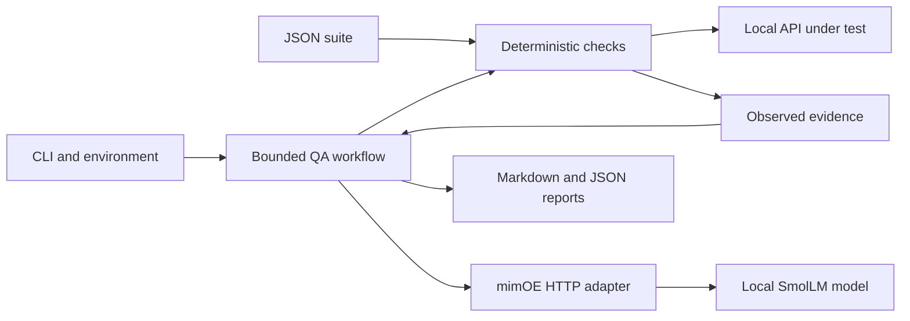

# mimOE QA Agent

A small Python agent that runs local API checks, finds contract violations, and asks a local mimOE model to draft QA analysis. Built for the mimOE **BYO Framework** assignment using direct HTTP calls.

**No runtime dependencies, cloud model, paid API, or hosted application.** Python 3.11+ and a running mimOE model are enough. The included demo starts and stops its own loopback API.

## Quick start (Windows PowerShell)

Load your model in mimOE Studio, then run:

```powershell
git clone https://github.com/victorsalmon/mimoe-qa-agent.git
cd mimoe-qa-agent

# Copy the base URL from Studio's API example, without /chat/completions.
$env:MIMOE_BASE_URL = 'http://localhost:8083/mimik-ai/openai/v1'
$env:MIMOE_MODEL = 'smollm-360m'

python -m mimoe_qa doctor
python -m mimoe_qa demo
Get-Content reports/latest/report.md
```

If Studio advertises a LAN IP, replace `localhost` with that address. Use the **exact model ID** from Studio: `smollm-360m` and `smollm2-360m` are different names. The default authorization value is mimOE's documented development default; set `MIMOE_API_KEY` in your environment if you changed it. No `.env` loader is used.

On macOS/Linux use `python3` and `export MIMOE_BASE_URL='http://localhost:8083/mimik-ai/openai/v1'` (and likewise for other variables).

Expected demo output:

```text
PASS: 4 | FAIL: 2 | ERROR: 0
```

**Exit code 1 is expected:** the demo API intentionally returns HTTP 200 for a missing item and accepts a negative quantity. The automated test suite verifies that both defects are detected; its exit code is 0.

See an actual [live model report](examples/live-report.md), [validation record](docs/VALIDATION.md), and [three-minute interview walkthrough](docs/DEMO.md).

## What it does

1. Validates a JSON test suite and local target URL.
2. Executes GET requests and asserts status codes and selected JSON fields.
3. Selects failed/error checks for model analysis, with a fixed call budget.
4. Writes Markdown and JSON reports containing evidence, deterministic bug drafts, and separately labeled AI suggestions.

The workflow is deliberately bounded. The model does not select URLs, execute code, alter assertions, or open tickets. It is an AI-assisted QA workflow agent, with application-controlled tool execution rather than an open-ended LLM tool-calling loop.

## Commands

```powershell
# Check /models and perform one real /chat/completions request.
python -m mimoe_qa doctor

# Full demo with local inference.
python -m mimoe_qa demo --output reports/my-demo

# Deterministic demo without mimOE.
python -m mimoe_qa demo --no-ai

# Use your own local API and suite; only GET requests are supported.
python -m mimoe_qa run --target http://127.0.0.1:8000 --suite examples/health-suite.json

# Limit inference calls (default 3, allowed 1–5).
python -m mimoe_qa demo --max-analyses 1

# Offline automated tests: no running mimOE instance required.
python -m unittest discover -v
```

The example health suite expects your own service to expose `GET /health` returning `{"status":"ok"}`. `demo` uses its own packaged suite and a temporary server; it requires no separate server terminal.

Optional installation exposes a console command:

```powershell
python -m venv .venv
.venv\Scripts\python -m pip install .
.venv\Scripts\mimoe-qa --help
```

Installing may download the build tool, setuptools. Running directly from the checkout requires no package downloads.

| Exit code | Meaning |
| --- | --- |
| 0 | All checks passed, or `doctor` succeeded |
| 1 | At least one assertion failed, with no execution/inference errors |
| 2 | Invalid configuration/suite, transport/protocol/report error, or requested AI analysis unavailable |
| 130 | Interrupted by the user |

A model outage does not erase completed check results. The agent records the error, stops further inference calls, writes the report, and exits with 2. A deliberately disabled or budget-skipped analysis is not an error.

## Configuration

| Environment variable | Default | Meaning |
| --- | --- | --- |
| `MIMOE_BASE_URL` | `http://localhost:8083/mimik-ai/openai/v1` | API base, excluding `/chat/completions` |
| `MIMOE_MODEL` | `smollm-360m` | Exact loaded model ID |
| `MIMOE_API_KEY` | mimOE development default | Bearer authorization; never written to reports |
| `MIMOE_TIMEOUT` | `60` | Inference socket timeout in seconds; greater than 0 and at most 300 |

Test requests use a 10-second socket timeout. Timeouts apply to blocking socket operations, not to the total elapsed duration. There are no automatic retries. HTTP response bodies are limited to 64 KiB; reports retain at most 4,000 body characters per check. Output files in the selected directory are replaced on each run.

## Write a test suite

```json
[
  {
    "id": "health",
    "description": "Service reports healthy",
    "path": "/health",
    "expected_status": 200,
    "expected_json": {"status": "ok"}
  }
]
```

Each object must contain exactly these five fields. IDs must be unique. Suites may contain 1–50 checks and must fit in 64 KiB. Paths start with one slash and may contain query parameters. Status expectations include 4xx/5xx, so negative cases are first-class tests.

`expected_json` compares the specified **top-level fields**, ignoring additional response fields. Values use exact equality and matching top-level Python types; nested values use Python equality. `{}` disables JSON assertions and tests status only. Missing/mismatched fields fail the check. An invalid JSON body when JSON fields are expected is a protocol `ERROR`.

## Architecture and decisions



- **Direct HTTP instead of a framework:** two inference routes and one GET-check tool need little orchestration. Python's standard library keeps setup and debugging simple.
- **Separation of responsibilities:** CLI wiring, assertions, inference, transport, demo fixtures, and reporting are independent modules. The analyst protocol allows offline fakes without subclass hierarchies.
- **Evidence before interpretation:** code decides pass/fail. Bug drafts include expected and actual behavior even when inference fails or is inaccurate.
- **Small-model support:** compact prompts, non-streaming responses, 120 generated tokens per analysis, sequential calls, and a capped analysis budget. `stream: false` was verified against the supplied local endpoint.

See [architecture details and tradeoffs](docs/ARCHITECTURE.md).

## Limitations and local data handling

The installed 360M-parameter model produced inaccurate explanations during live testing, including invented implementation details. Shorter prompts and a worked example did not reliably fix this. AI notes are drafts requiring review; a successful API response is **not** proof of accurate reasoning. The checked-in live report preserves actual output rather than rewriting it to look better.

The target and inference URLs accept `localhost` or literal private/loopback IPs. Requests bypass configured proxies and do not follow redirects. The demo binds only to loopback. This is a local development tool, not a production security boundary: run suites against services you control. GET endpoints can still have application-specific side effects.

Only descriptions, paths, and assertion messages enter the model prompt; raw response bodies do not. Field mismatch messages may contain response values. Reports contain response evidence and are ignored by Git by default; review reports before sharing. The committed example contains only synthetic demo data. Runtime makes no cloud model calls; GitHub Actions runs offline fixtures and packaging checks only.

The initial scope excludes POST/authenticated target APIs, browser automation, load testing, nested field selectors, ticket integrations, generated executable tests, and persistent conversation memory.

## AI assistance and references

This project was built with OpenAI Codex assistance, including implementation, tests, documentation, and live endpoint verification. The design and validation record are included so the candidate can explain and evaluate the result rather than treat generated code as evidence of correctness.

- [mimOE Studio and BYO Framework assignment entry point](https://developer.mimik.com/mimOE-studio-early-access-download-v2)
- [mimOE developer portal: local inference example](https://developer.mimik.com/)
- [mimOE addon configuration and development API key](https://developer.mimik.com/docs/api/addon-configuration)
- [Python urllib.request documentation](https://docs.python.org/3/library/urllib.request.html)
